Traversing the design space  
or  
making gifs of variable fonts in drawbot

## Intro
I have posted a tutorial on how to use a variable font in drawbot with a very basic linear interpolation. The example only used one axis and sure enough somebody asked about an addition to interpolate six axes. Since there is not ONE answer to this question, it got me thinking about several different aspects (exponential explosions, too difficult to generalize, what route to take, etc) of multidimensional (or multiaxial) paths and animations.

Scripting and interpolation make it very easy to extend the designspace but exponential growth might make it very hard to keep all corners of the designspace under control. Visualizing it might help to decide which areas are relevant and which combinations of axis values might be useless.

Different designs and axes need different solutions and there are several ways on how to traverse a line, area, cube or multidimensional space. So the following scripts should not be considered as answers but be regard as sketches. They show some of the ideas and might or might not work for your type and designspace designs. Some of the code is written rather horrible with not very descriptive variable names, not very efficient math and it is definitely not tested properly. You might still .gif it a try.

## The fonts

For the animations with two axes the typeface Skia is used. It comes with macOS and even works on OS 10.10.  
For the animations with more axes I generated three rough fonts.  
– ```hope.ttf``` has three axes (Weight, Width and Contrast) and only has the glyphs 'h', 'o', 'p' and 'e'.  
– ```varA.ttf``` includes only the letter 'A'. It has six axes (Weight for each stroke of the 'A'. Angle on the two slanted strokes and Height on the crossbar).  
– ```face.ttf``` only comes with the letter 'A' but has eight axes. Different facial features are shifting in the vertical or horizontal direction.


## Walk on one axis

With one axis the design space can be visualized as a line (call it a slider if you want to). Usually there are two extremes as the endpoints. A minimum value at one point and a maximum value at another point. Moving from one to the other and stopping at different locations will give you an idea of what can happen in between. The more stops the better the picture.

### Continuous speed
The simplest way to walk is linearly with continuous speed.  
[1axis_skia.py](1axis_code/1axis_skia.py)  

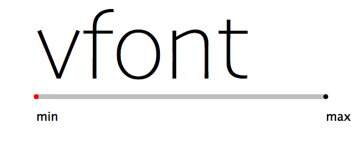  

### Increasing speed
However this might not be a good idea for every axis. Sometimes it is better to use different speeds and changing increments. Easing in or out of the movement or get exponentially faster. The typical axis to walk with an increasing speed instead of a constant one is the weight axis. In the light area we want small steps and with increase of weight we need bigger steps. Here is an example based on the formula developed by Lucas de Groot.  
[1axis_skia.py](1axis_code/1axis_skia.py)  

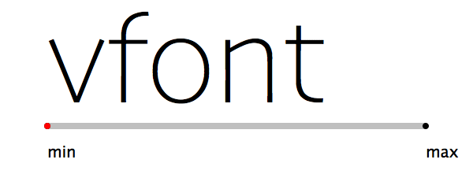

### Plot axis values
Most axes of a variable font have a minimum, maximum and also a default value. The position of the latter between the two extremes might give an idea on what interpolation curve to take.

The weight axis of Skia has the default closer to the minimum whereas the width value is almost halfway.  
[draw_axisVals.py](1axis_code/draw_axisVals.py)

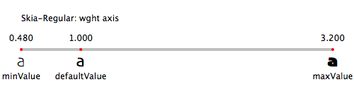  

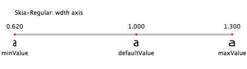  

### Sinus wave interpolation
If we calculate the next step with a sinus curve we can make a simple ease in and out animation. The steps are smaller at the start and end and biggest in the middle of the walk.  
[1axis_skia.py](1axis_code/1axis_skia.py)

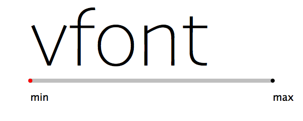

### Random Bezier interpolation
We could also define two offcurve points between the minimum and maximum and calculate the steps in between with the help of bezier math.  
[1axis_skia.py](1axis_code/1axis_skia.py)  

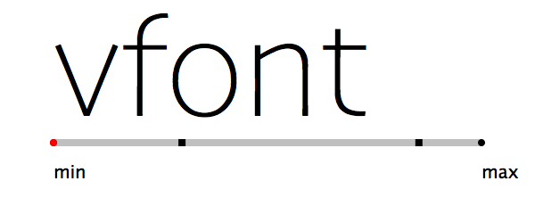


## Traversing an area defined by two axes

As soon as we add another axis our linear 1d designspace can be visualized as a 2d area. Now the path is not so obvious anymore. If we want to visit all combinations of the extremes of each axis we have 4 points to visit. But we could also take a path that does not pass through any of the corners. Another possibly important point to visit is the position of the default values or the mathematical center of the designspace.

### Going from both minima to both maxima
Analog to the linear interpolation of one axis with continuous speed we could do the same with two axes. This does not come close to two corners and does not make for the most interesting animation.  
[area_mintomax.py](2axes_code/area_mintomax.py)

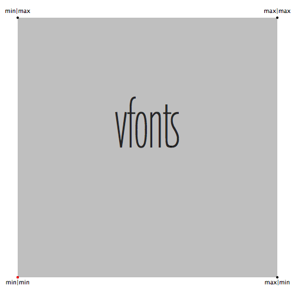  

### Mixing of two different calculations
Since we now have two axes we could mix different calculations. Here is an examples with a linear interpolation for the width axis and an exponential one for the weight axis.  
[area_diff_curves.py](2axes_code/area_diff_curves.py)  

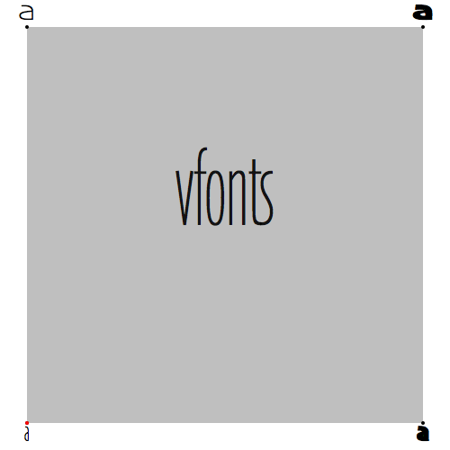  

### Linear iteration through both axes
Doing a (shifting) double iteration of both axes covers the whole design space but gives a bit a bouncy animation.  
[area_doubleLoop_switching.py](2axes_code/area_doubleLoop_switching.py)  

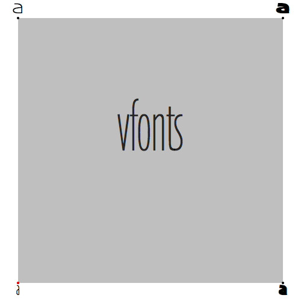  


### A circular movement
within the area makes a quite nice animation. One drawback might be to not visit any of the extreme values and most likely we do not visit the default values. The black dot in the gray area shows the default value of both axes of the Skia typeface.   
[area_circular.py](2axes_code/area_circular.py)  

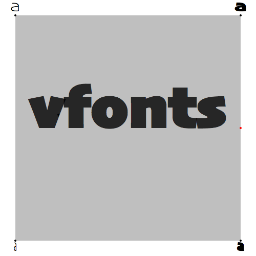  


### Lissajous style
A very nice calculation that can be looped easily are Lissajous curves. Depending on what values you choose the curve can get fairly close to the corners of the designspace and still visit the mathematical center.  
[area_lissajous.py](2axes_code/area_lissajous.py)  

  

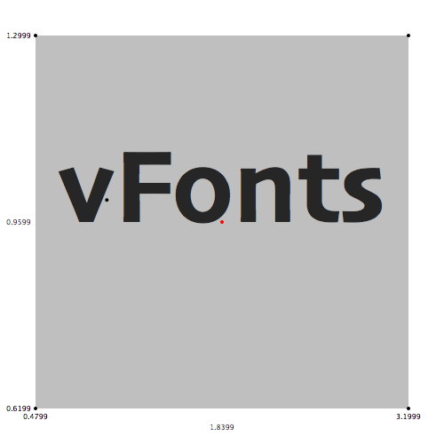  


### Bezier curve style
we could also draw a bezier curve within the designspace and walk along this curve to animate the variable font.   
[area_Bezier.py](2axes_code/area_Bezier.py)

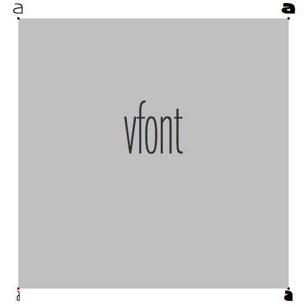  


## Traversing a volume defined by three axes
Three axis in euclidian space can still be visualized fairly easy. The designspace can be rendered as a cube. However more than two axes means there are now more corners (8) of the designspace than endpoints of all axes (6). With the addition of each axis the complexity grows exponentially.


### Visiting all corners of a cube
If we would like to visit all 8 corners of a cube in what order do we do this? The factorial (8!) tells us there are 40320 different ways to visit 8 points. Yes, some of these paths can be omitted if they are looped but there are still too many to choose from. Itertools is a very helpful python module to get all kinds of combinations. If we just randomly select one the 40320 possible orders we can interpolate between them.

[isometricCube-sinus.py](3axes_code/isometricCube-sinus.py)  
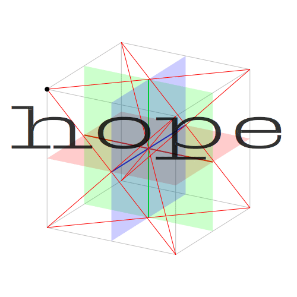


### Travelling through the cube Lissajous Style
The two values of the lissajous curve could be extended to more values. For each point on the lissajous wave we get a x, y and z coordinate which is mapped to the values of the variable font.  
[isometricCube-lissajous.py](3axes_code/isometricCube-lissajous.py)

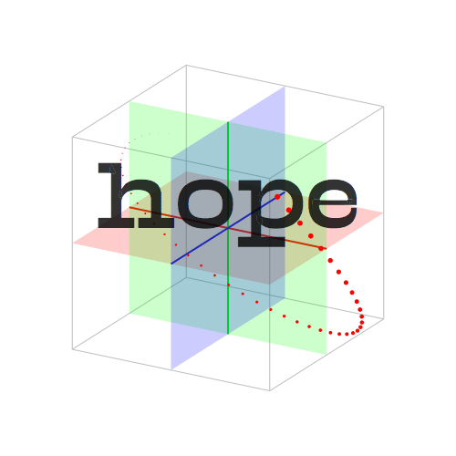  


## More than three axes
Visualizing more than three axes starts to get more complicated. We might try building a tesseract but the simpler approach is to just use sliders. I quite like 	María Ramos’ proposal to arrange the sliders around a mathematical center point and used this setting for some of the following visualizations.  

Just to show the rapid increase of the exponential curve: with four axes there would be 16 (```2**4```) possible combinations of the extremes. The factorial (16!) tells us there are 20,922,789,890,000 possible paths to visit all of these corners of the designspace. Compare that to a two hour movie which has 180,000 frames (at 25 fps).  

With six axes there are 64 (```2**6```) possible combinations of the extreme values. If we would add one step in between there would be 729 (```3**6```).  

The following is the simplest path visiting all 64 extremes of the designspace with a few interpolated steps.   

[polar_combinations_sinus_6axes.py](6axes_code/polar_combinations_sinus_6axes.py)  
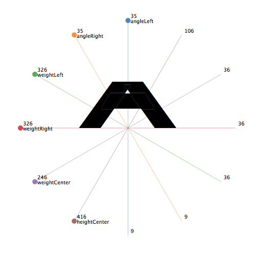  


### Polar with sinus wave of each axis
Each axis value loops through the full axis with the same sinus wave but has a different starting point.  
[polar_sinus_varA_6axis.py](6axes_code/polar_sinus_varA_6axis.py)  


### Slider list with sinus wave for each axis
This is like the above animation but the axes are not arranged around a center point but listed in a traditional way.  
[sliders_sinus_varA_6axis.py](6axes_code/sliders_sinus_varA_6axis.py)

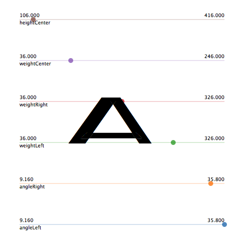

### Bezier path polar chart
Each axis value goes from the minimum to the maximum value following a bezier path with random generated offcurve points.
[polar_bezier_ownVarFont_6axis.py](6axes_code/polar_bezier_ownVarFont_6axis.py)  

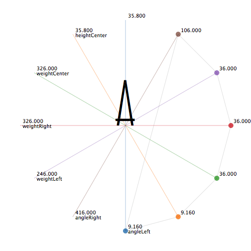   

### Lissajous
Again the lissajous wave can be extended with more coordinates and these coordinates can be mapped to the values of the variable font axes.

[polar_lissajous_6axes.py](6axes_code/polar_lissajous_6axes.py)  

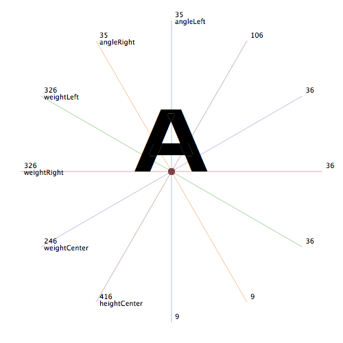


### Lissajous style with 8 axes
Here is one more example with a lissajous style interpolation of eight axes.
[polar_lissajous_face_8axes.py](8axes_code/polar_lissajous_face_8axes.py)

  


## Resources
I am by no means an expert on the topic and several people who actually know what they are doing held lectures and wrote about interpolation, visualization of the designspace, and variable fonts:

Some of Erik van Bloklands talks are available on [youtube](
https://www.youtube.com/watch?v=3RRoIYeJ3YQ)

Underware is doing impressive stuff with [higher order interpolation](https://www.youtube.com/watch?v=KfbhL7SMNDo) (HOI).

Luc de Groot [lecture about nonlinear interpolation and multidimensional visualisations](https://www.youtube.com/watch?v=I75Efo7whrs)

María Ramos proposed the very interesting idea of [using polar charts to visualize the designspace](https://www.alphabettes.org/design-space-variable-fonts/)
